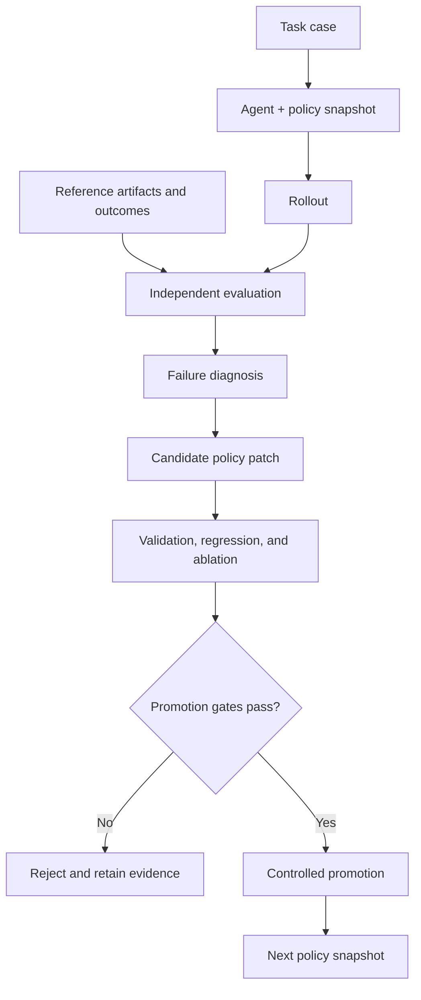

# KPO — Knowledge Policy Optimization

> Status: v0.1 MVP. The core optimization, regression, safety, and synthetic
> demonstration paths are implemented and covered by deterministic tests.

KPO is a framework for improving the **external knowledge policy** used by an
Agent without modifying the underlying model weights.

## The original idea

Traditional reinforcement learning improves a model by updating parameters.
KPO moves the optimization target outside the model:

1. An Agent loads a versioned knowledge policy and analyzes a task.
2. Independent evaluators compare the result with reference artifacts, observed
   outcomes, and explicit rubrics.
3. The system diagnoses whether a failure came from missing knowledge,
   retrieval, policy application, invalid reasoning, or an evaluation problem.
4. It proposes a minimal, reviewable change to the knowledge policy.
5. The candidate is replayed against validation and regression suites.
6. Only candidates that pass promotion gates may enter the active policy.

The model stays fixed while the policy surrounding it becomes more useful,
precise, and evidence-grounded.

## Why optimize a knowledge policy?

- **Interpretable** — improvements are explicit text or structured artifacts.
- **Versionable** — every rule, example, limit, and patch can be reviewed.
- **Reversible** — a harmful policy version can be rolled back.
- **Model-agnostic** — the same policy can be evaluated with different Agent
  models and runtimes.
- **Evidence-driven** — rules advance through observed performance, not through
  self-asserted quality.

KPO is not intended to make a model's own output automatically become truth.
Fidelity to a reference and factual validity are separate evaluation axes.

## Conceptual loop



## Repository boundary

This repository contains the generic engine, specifications, schemas, synthetic
fixtures, and tests. It deliberately excludes real-world profiles, source
corpora, rollout transcripts, evidence logs, and candidate patches.

External knowledge stores are read-only during ordinary operations. Runtime
artifacts live in a user-controlled data directory outside the checkout.
Writing back to a knowledge store is a separate, explicitly approved promotion
operation with an allowlist, diff, snapshot, and journal.

## MVP capabilities

- immutable case, policy, rollout, evaluation, diagnosis, and candidate schemas;
- provider-neutral Actor and Evaluator protocols with hidden-reference
  isolation;
- explicit failure attribution and provenance-complete candidate patches;
- matched validation, holdout, regression, and ablation measurements;
- content-addressed runtime artifacts and an explicit run state machine;
- preview-first promotion with allowlists, digest-bound approval, snapshots,
  journals, and interruption recovery;
- repository and privacy hygiene checks;
- a deterministic, network-free end-to-end demonstration.

Real model-provider and profile adapters are intentionally outside this first
MVP. The stable protocols can accept them without placing real policy or domain
data in this repository.

## Run the synthetic demonstration

KPO requires Python 3.12 or newer. With
[uv](https://docs.astral.sh/uv/) installed:

```bash
uv sync --dev

KPO_DEMO_ROOT="$(mktemp -d)"
uv run kpo demo \
  --data-home "$KPO_DEMO_ROOT/runtime" \
  --target-root "$KPO_DEMO_ROOT/knowledge"
```

The demonstration starts with a deliberately incomplete policy. A hidden
reference exposes a missing applicability boundary; KPO proposes one minimal
rule and replays separate synthetic partitions. Expected summary:

```json
{
  "baseline_score": 0.2,
  "candidate_score": 1.0,
  "validation_gain": 0.8,
  "holdout_gain": 0.8,
  "regression_gain": 0.8,
  "ablation_gain": 0.8,
  "regression_passed": true,
  "source_unchanged": true,
  "promotion_state": "preview_only"
}
```

The remaining output includes content digests and the exact promotion diff.
The demo never applies that diff.

## Verify the repository

```bash
uv run pytest
uv run kpo hygiene --repo .
```

An optional local denylist can extend the public checks without publishing its
terms:

```bash
uv run kpo hygiene --repo . --denylist /path/outside/repository/denylist.txt
```

## Development method

KPO follows Spec-Driven Development and Test-Driven Development:

1. approve the behavior specification;
2. write failing tests;
3. implement the smallest passing behavior;
4. refactor with regression protection.

The approved v0.1 specification is in
[`docs/specs/0001-kpo-v0.1.md`](docs/specs/0001-kpo-v0.1.md).
