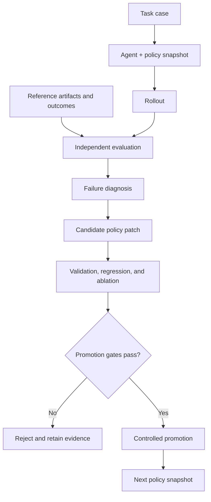

# KPO — Knowledge Policy Optimization

> Status: v0.5 development milestone. KPO can run finite, budgeted
> optimization campaigns, persist reviewable promotion transactions, and
> explicitly apply or recover approved policy updates.

KPO is a framework for improving the **external knowledge policy** used by an
Agent without modifying the underlying model weights.

## The original idea

Traditional reinforcement learning improves a model by updating parameters.
KPO moves the optimization target outside the model:

1. An Agent loads a versioned knowledge policy and analyzes a task.
2. Independent evaluators compare the result with reference artifacts, observed
   outcomes, and explicit rubrics.
3. The system diagnoses whether a failure came from missing knowledge,
   retrieval, policy application, invalid reasoning, or an evaluation problem.
4. It proposes a minimal, reviewable change to the knowledge policy.
5. The candidate is replayed against validation and regression suites.
6. Only candidates that pass promotion gates may enter the active policy.

The model stays fixed while the policy surrounding it becomes more useful,
precise, and evidence-grounded.

## Why optimize a knowledge policy?

- **Interpretable** — improvements are explicit text or structured artifacts.
- **Versionable** — every rule, example, limit, and patch can be reviewed.
- **Reversible** — a harmful policy version can be rolled back.
- **Model-agnostic** — the same policy can be evaluated with different Agent
  models and runtimes.
- **Evidence-driven** — rules advance through observed performance, not through
  self-asserted quality.

KPO is not intended to make a model's own output automatically become truth.
Fidelity to a reference and factual validity are separate evaluation axes.

## Conceptual loop



## Repository boundary

This repository contains the generic engine, specifications, schemas, synthetic
fixtures, and tests. It deliberately excludes real-world profiles, source
corpora, rollout transcripts, evidence logs, and candidate patches.

External knowledge stores are read-only during ordinary operations. Runtime
artifacts live in a user-controlled data directory outside the checkout.
Writing back to a knowledge store is a separate, explicitly approved promotion
operation with an allowlist, diff, snapshot, and journal.

## Current capabilities

- immutable case, policy, rollout, evaluation, diagnosis, and candidate schemas;
- provider-neutral Actor and Evaluator protocols with hidden-reference
  isolation;
- explicit failure attribution and provenance-complete candidate patches;
- matched validation, holdout, regression, and ablation measurements;
- content-addressed runtime artifacts and an explicit run state machine;
- preview-first promotion with allowlists, digest-bound approval, snapshots,
  journals, and interruption recovery;
- repository and privacy hygiene checks;
- a deterministic, network-free end-to-end demonstration;
- strict external TOML profiles with JSON/JSONL manifests;
- real subprocess provider execution through a versioned JSON protocol;
- cross-process `run`, `evaluate`, and `status` persistence;
- source-drift detection, opt-in provider environments, and stderr redaction;
- strict four-part datasets with provenance, deduplication, contamination checks,
  and an immutable holdout lock;
- finite campaigns with explicit iteration and provider-call budgets;
- train-only diagnosis and Proposer feedback that withholds holdout details;
- matched per-dimension validation, holdout, regression, and ablation gates;
- persistent provider-call caching, failure records, and resumable failed runs;
- preview-approved dataset growth with snapshots, journals, and recovery;
- immutable campaign promotion bundles containing both policy-content and
  policy-manifest diffs;
- explicit digest-approved `promote` apply with a persistent lock, journaled
  two-file transaction, and interruption recovery;
- natural campaign chaining: the next ordinary campaign reloads the applied
  policy as its parent;
- byte-exact source and target integrity checks that avoid hashing the same
  physical file twice within one verification pass.

Provider-specific SDK wrappers remain external. A wrapper can connect the
command protocol to a local model, remote API, Gateway, or existing Agent
runtime without placing real policy or domain data in this repository.

Command adapters are trusted plugins. KPO reduces accidental access with an
external working directory, a minimal environment, and path-free requests, and
it detects source or promotion-target drift after every provider call. It does
not claim to stop a malicious process that already has the operating system
user's file permissions. Hard write prevention requires an operator-managed
container or read-only mount and is not provided by v0.3.

## Run the synthetic demonstration

KPO requires Python 3.12 or newer. With
[uv](https://docs.astral.sh/uv/) installed:

```bash
uv sync --dev

KPO_DEMO_ROOT="$(mktemp -d)"
uv run kpo demo \
  --data-home "$KPO_DEMO_ROOT/runtime" \
  --target-root "$KPO_DEMO_ROOT/knowledge"
```

The demonstration starts with a deliberately incomplete policy. A hidden
reference exposes a missing applicability boundary; KPO proposes one minimal
rule and replays separate synthetic partitions. Expected summary:

```json
{
  "baseline_score": 0.2,
  "candidate_score": 1.0,
  "validation_gain": 0.8,
  "holdout_gain": 0.8,
  "regression_gain": 0.8,
  "ablation_gain": 0.8,
  "regression_passed": true,
  "source_unchanged": true,
  "promotion_state": "preview_only"
}
```

The remaining output includes content digests and the exact promotion diff.
The demo never applies that diff.

## Run an external profile

External profiles keep policy, cases, hidden references, provider commands, and
runtime data outside the KPO checkout. After preparing a profile that follows
the [v0.2 specification](docs/specs/0002-external-profile-execution.md):

```bash
uv run kpo validate-profile --profile /path/outside/kpo/profile.toml
uv run kpo run --profile /path/outside/kpo/profile.toml --case case-001
uv run kpo evaluate --profile /path/outside/kpo/profile.toml --run RUN_ID
uv run kpo status --profile /path/outside/kpo/profile.toml --run RUN_ID
```

`run` does not print the Agent output. `evaluate` loads only the selected case's
hidden references, and rejects the operation if any recorded source changed
after the rollout.

## Run an optimization campaign

A campaign profile extends the external profile with a dataset manifest,
Proposer adapter, per-dimension gates, budgets, and promotion destinations. The
[v0.3 specification](docs/specs/0003-optimization-campaign.md) defines the full
contract.

```bash
# Validate all profile, dataset, gate, path, and adapter contracts.
uv run kpo validate-profile --profile /path/outside/kpo/profile.toml

# Freeze the initial holdout set through preview-bound approval.
uv run kpo dataset init --profile /path/outside/kpo/profile.toml
uv run kpo dataset init \
  --profile /path/outside/kpo/profile.toml \
  --approve APPROVAL_DIGEST

# Run until a promotion preview, a finite budget, or another terminal condition.
uv run kpo campaign --profile /path/outside/kpo/profile.toml
uv run kpo campaign-status \
  --profile /path/outside/kpo/profile.toml \
  --campaign CAMPAIGN_ID
```

Dataset expansion follows the same preview/approval rule:

```bash
uv run kpo dataset grow \
  --profile /path/outside/kpo/profile.toml \
  --inbox /path/outside/kpo/candidate-dataset.jsonl
```

The holdout partition cannot be added to, removed from, edited, reweighted, or
repartitioned after initialization. A passing campaign stops at a promotion
preview; applying that change remains a separate consequential decision.

Review and apply a passing campaign as separate commands:

```bash
# Revalidate the immutable bundle and print both diffs plus its approval digest.
uv run kpo promote \
  --profile /path/outside/kpo/profile.toml \
  --campaign CAMPAIGN_ID

# Apply exactly the reviewed content + manifest transaction.
uv run kpo promote \
  --profile /path/outside/kpo/profile.toml \
  --campaign CAMPAIGN_ID \
  --approve APPROVAL_DIGEST

# Only after an interrupted apply leaves the persistent lock in place.
uv run kpo promote \
  --profile /path/outside/kpo/profile.toml \
  --campaign CAMPAIGN_ID \
  --recover
```

The approval digest binds the candidate, report and policy digests, both
relative paths, exact original/reviewed bytes, and both displayed diffs. KPO
never infers this value for a real profile. Recovery restores an interrupted
prepared transaction; it does not roll back a committed promotion.

## Verify the repository

```bash
uv run pytest
uv run kpo hygiene --repo .
```

An optional local denylist can extend the public checks without publishing its
terms:

```bash
uv run kpo hygiene --repo . --denylist /path/outside/repository/denylist.txt
```

## Development method

KPO follows Spec-Driven Development and Test-Driven Development:

1. approve the behavior specification;
2. write failing tests;
3. implement the smallest passing behavior;
4. refactor with regression protection.

Approved specifications:

- [v0.1 optimization core](docs/specs/0001-kpo-v0.1.md)
- [v0.2 external profile execution](docs/specs/0002-external-profile-execution.md)
- [v0.3 optimization campaign](docs/specs/0003-optimization-campaign.md)
- [v0.4 exact integrity deduplication](docs/specs/0004-exact-integrity-deduplication.md)
- [v0.5 external promotion and chaining](docs/specs/0005-external-promotion-and-chaining.md)
